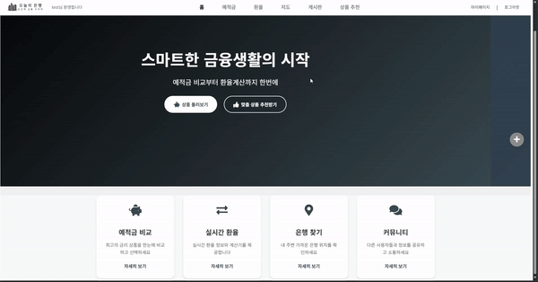
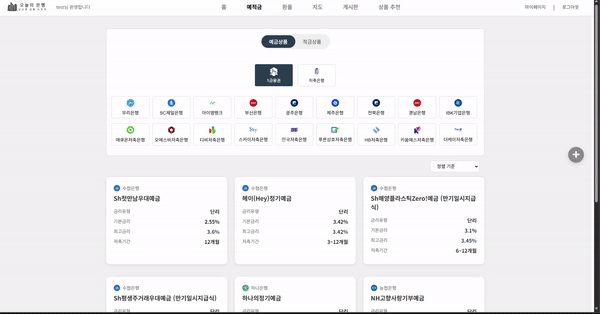
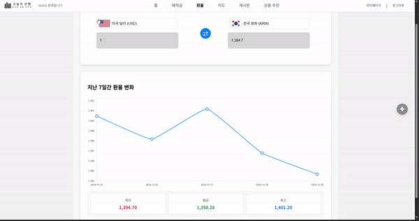
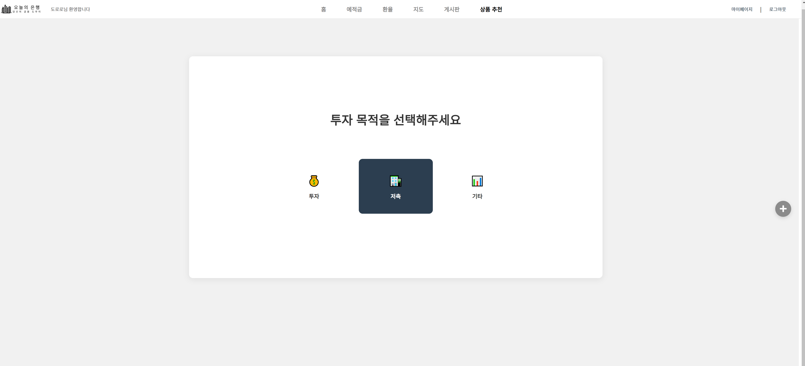
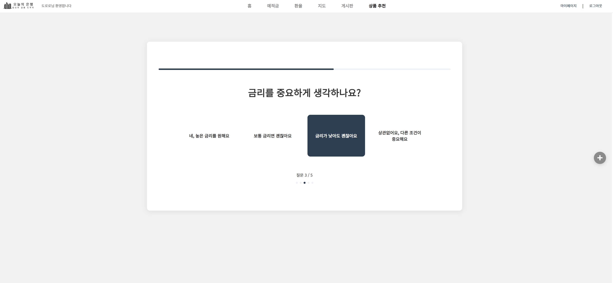
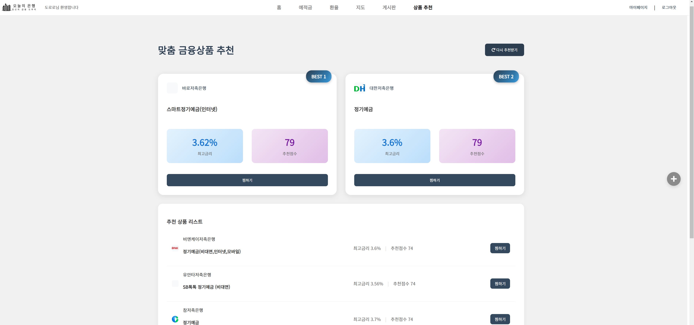
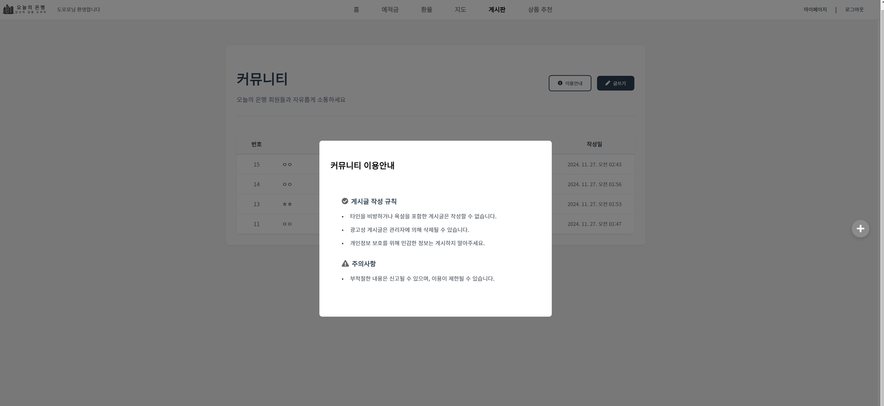
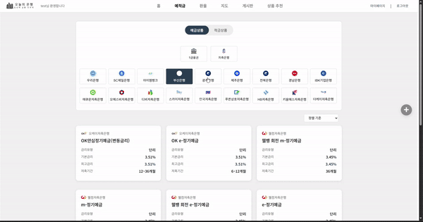
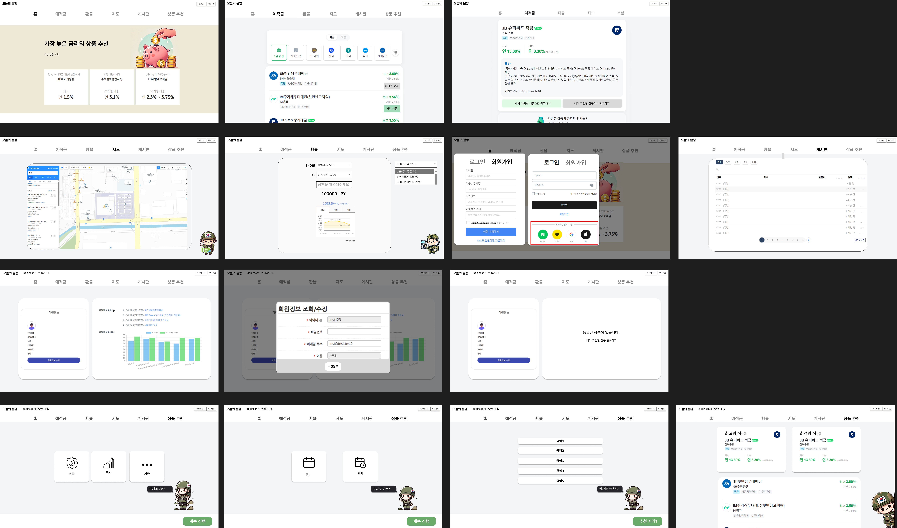
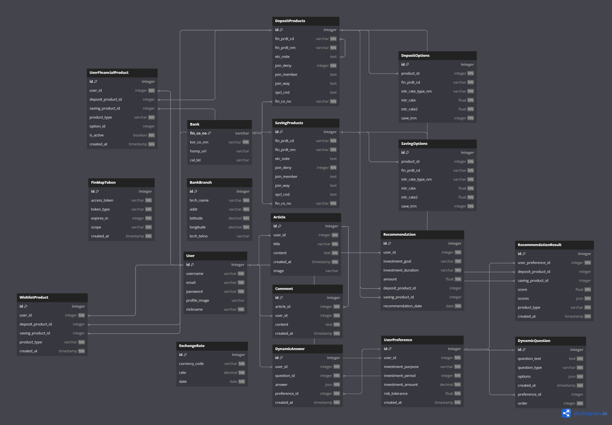

# 오늘의 은행 (Today's Bank)

## 프로젝트 개요

- **프로젝트 이름**: 오늘의 은행
- **팀명**: 강도 (KANGDO)
- **팀원**: 도승국, 강민석
- **프로젝트 기간**: 2024년 11월 18일 \~ 2024년 11월 27일
- **사용 기술 스택**:
  - **백엔드**: Node.js, TypeScript, SQLite
  - **프론트엔드**: Vue.js, SCSS
  - **데이터베이스**: SQLite
  - **API 활용**: 금융감독원, Kakao Maps, 한국수출입은행 API
---
## 팀원 정보 및 업무 분담

| 팀원  | 역할 및 담당 기능                       |
| --- | -------------------------------- |
| 도승국 | 홈, 예적금, 환율 계산기, 지도 기능 구현         |
| 강민석 | 커뮤니티 (로그인, 회원가입 등), 상품 추천, 챗봇 구현 |
---
## 설계 내용 및 실제 구현 정도

### 시스템 아키텍처

- 본 프로젝트는 **클라이언트-서버 구조**를 기반으로 설계되었으며, Node.js와 TypeScript로 백엔드를, Vue.js로 프론트엔드를 개발하여 명확한 역할 분리를 구현했습니다.
- **API Gateway** 역할을 백엔드에서 수행하여 클라이언트 요청을 적절한 서비스로 라우팅하고 금융 데이터 및 환율 정보를 외부 API와 연동했습니다.

### 구현된 기능 및 서비스 대표 기능

### 1. 홈 페이지

- Swiper를 활용한 배너와 각 서비스로 이동할 수 있는 서브버튼들로 구성했습니다.

### 2. 예적금 금리 비교 및 검색: 

- 금융감독원 API를 통해 제1금융권과 저축은행의 예적금 상품을 모두 제공하며, 사용자가 은행 로고를 클릭하여 원하는 은행의 상품만 필터링할 수 있습니다(중복 선택 가능).
- Swiper를 통해 상품 목록을 좌우로 넘길 수 있으며, 최고 기본금리순/우대금리순으로 정렬할 수 있습니다. 
- 카드 형식의 상품 목록은 무한스크롤 방식으로 구현되어 스크롤 시 자동으로 추가 목록이 로드됩니다.
- 상품 선택 시 모달 방식으로 상세페이지가 열리며, 원하는 상품을 가입 목록에 추가할 수 있습니다.

### 3. **환율 계산기**: 

- 한국수출입은행 API를 활용하여 실시간 환율 정보를 제공합니다.
- 사용자가 금액을 입력하면 실시간으로 환전된 값이 계산됩니다.
- 국가 선택 시 해당 국가의 국기가 자동으로 표시되며, 양방향 환전이 가능한 반응형 기능을 제공합니다.
- 최근 7일간의 환율 변동을 그래프로 시각화하고, 해당 기간의 최소/평균/최대 환율 정보를 제공합니다.

### 4. **주변 은행 찾기 (지도 기능)**: 

- Kakao Maps API를 활용하여 사용자 친화적인 은행 위치 검색 서비스를 구현했습니다.
- 지역명이나 은행명으로 검색하면 해당 위치로 지도가 자동 이동합니다.
- 왼쪽 사이드바의 은행 목록에서 원하는 은행을 필터링할 수 있으며, 특정 은행을 선택하면 해당 위치로 지도가 이동합니다. 
- 지도에서 핀을 선택 시 은행 목록 역시 이동합니다.
- 선택한 은행까지의 도보/자동차 예상 소요 시간이 자동으로 계산되어 표시되며, 로드뷰를 통해 실제 주변 환경도 확인할 수 있습니다.
- 화면 우측 하단의 나침반 버튼을 통해 언제든지 현재 위치로 돌아올 수 있습니다.

### 5. **금융 상품 추천 시스템**: 

- 다음과 같은 단계로 맞춤형 금융 상품을 추천해드립니다:
   1. 사용자의 기본적인 투자 성향을 파악하기 위한 3가지 기본 질문을 제시합니다.
   2. AI가 초기 응답을 분석하여 5가지 추가 맞춤형 질문을 생성합니다.
   3. 모든 응답을 종합 분석하여 최적의 금융 상품을 추천해드립니다.

### 6. **커뮤니티 기능**: 

- 사용자들이 자유롭게 소통하고 금융 상품에 대한 리뷰를 공유할 수 있는 공간입니다.
- 이용안내 버튼을 통해 게시판 이용 규칙과 주의사항을 확인할 수 있습니다.
- 로그인한 회원만 글작성이 가능하며, 작성된 글과 댓글은 작성자 본인만 수정/삭제할 수 있습니다.

### 7. **회원 관련 기능**: 

- 기본적인 회원가입과 로그인 기능을 제공합니다.
- **마이페이지**에서는 가입한 예적금 상품과 찜한 추천 상품 목록을 확인할 수 있으며, 이를 그래프로 시각화하여 쉽게 비교할 수 있습니다.
- 회원 정보 수정 기능도 제공합니다.

---
## figma

---
## 데이터베이스 모델링 (ERD)
사용자의 금융 정보와 추천 시스템을 중심으로 데이터베이스를 설계했으며, 주요 엔티티와 관계는 아래와 같습니다:

---
## 금융 상품 추천 알고리즘 설명

- **기본 개요**: 사용자의 투자 성향과 맞춤형 질문에 대한 응답을 기반으로 최적의 금융 상품을 추천하는 시스템입니다.
- **추천 방법**: 초기 응답을 바탕으로 AI가 동적으로 질문을 생성합니다. 이 질문들은 **수익성**, **안정성**, **접근성**, **유연성**을 기준으로 생성되며, 응답에 따라 가중치 알고리즘을 적용하여 최종 점수를 산정합니다. 동점인 경우에는 랜덤 알고리즘을 통해 다양한 추천이 이루어지도록 했습니다.
---
## 생성형 AI 활용 부분

- 초기 챗봇 구현 계획을 발전시켜, AI 기반의 동적 질문 생성 시스템을 구축했습니다.
- GPT를 활용하여 사용자별 맞춤형 질문을 생성하고, 응답을 분석하여 최적의 금융 상품을 추천하는 시스템을 구현했습니다.
---
## 느낀 점 및 후기

- **강민석**
  - **배운 점**: 더미 코드의 즉각적인 정리와 애자일 방식의 개발이 프로젝트 발전에 큰 도움이 된다는 것을 배웠습니다.
  - **느낀 점**: OAuth 연동과 실시간 데이터 처리 과정에서 더 높은 수준의 백엔드 지식이 필요함을 실감했습니다.

- **도승국**
  - **배운 점**: Django와 DRF를 통한 API 설계의 중요성을 배웠으며, Figma를 활용한 UI/UX 설계 경험을 쌓았습니다.
  - **느낀 점**: 코드의 가독성과 유지보수의 중요성을 깊이 이해하게 되었습니다.

- **공통**
  - Git을 활용한 협업 과정에서 효율적인 코드 관리와 의사소통의 중요성을 배웠습니다.

---

